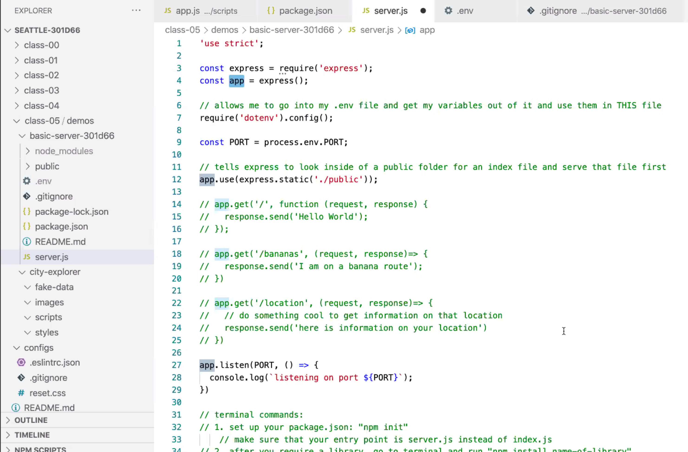

# Class 05

## Navigation ##
 - [class 01](class-01.md)
 - [class 02](class-02.md)
 - [class 03](class-03.md) 
 - [class 04](class-04.md)
 - [class 05](class-05.md)
 - [class 06](class-06.md)
 - [class 07](class-07.md)
 - [class 08](class-08.md)
 - [class 09](class-09.md) 
 - [class 10](class-10.md)
 - [class 11](class-11.md)
 - [class 12](class-12.md)
 - [class 13](class-13.md)
 - [class 14a](class-14a.md)
 - [class 14b](class-14b.md)

# Read: 05 - Heroku Deployment

## Reading
[Heroku: Getting Started with Node](https://devcenter.heroku.com/articles/getting-started-with-nodejs#introduction)
Complete all of the steps through “View logs”
## Bookmark/Skim
[Deploying a Simple Blog to Heroku](https://howtonode.org/deploy-blog-to-heroku)

## Set up
The Heroku CLI requires Git, the popular version control system. If you don’t already have Git installed, complete the following before proceeding:

[Git installation](https://git-scm.com/book/en/v2/Getting-Started-Installing-Git)
[First-time Git setup](https://git-scm.com/book/en/v2/Getting-Started-First-Time-Git-Setup)

When installation completes, you can use the heroku command from your terminal.

On Windows, start the Command Prompt (cmd.exe) or Powershell to access the command shell.
Use the heroku login command to log in to the Heroku CLI:

heroku login
heroku: Press any key to open up the browser to login or q to exit
 ›   Warning: If browser does not open, visit
 ›   https://cli-auth.heroku.com/auth/browser/***
heroku: Waiting for login...
Logging in... done
Logged in as me@example.com
This command opens your web browser to the Heroku login page. If your browser is already logged in to Heroku, simply click the Log in button displayed on the page.

This authentication is required for both the heroku and git commands to work correctly.

Before you continue, check that you have the prerequisites installed properly. Type each command below and make sure it displays the version you have installed. (Your versions might be different from the example.) If no version is returned, go back to the introduction of this tutorial and install the prerequisites.

All of the following local setup will be required to complete the “Declare app dependencies” and subsequent steps.

This tutorial will work for any version of Node greater than 8 - check that it’s there:

node --version
v12.16.3
npm is installed with Node, so check that it’s there. If you don’t have it, install a more recent version of Node:

npm --version
6.14.4
Now check that you have git installed. If not, install it and test again.

git --version
git version 2.17.0

## Error Messages

Error pages are not what typically appear on your screen when you're surfing the web, but when it happens it's so annoying! To see how servers work from within, we will build a simple web server by ourselves. We will use Node.js as a server part technology for that task. Then we'll use Heroku cloud application platform to turn this local server into a world wide server.

## How Can I?

We will use Node.js for our project. Node.js is an open source, cross-platform runtime environment, which allows you to build server-side and networking applications. It's written in JavaScript and can be run within the Node.js runtime on any platform. First of all, of course, you need to install it. You'd better check the download page for more details. I'll wait until you finish, so don't worry. Is it done? Great! Now you can create your first web server. And it will be one of the easiest tasks in your life.

## Its a Server

          var http = require("http");

          http.createServer(function(request, response) {
            response.writeHead(200, {"Content-Type": "text/plain"});
            response.write("It's alive!");
            response.end();
          }).listen(3000);

